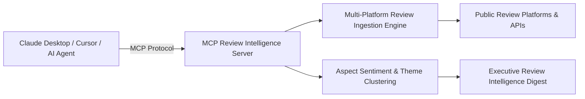

# 💬 MCP Review Intelligence — Customer Sentiment & Review Aggregator Server

<p align="center">
  <strong>A Model Context Protocol (MCP) server for aggregating public product reviews, analyzing customer sentiment, and surfacing recurring themes for AI agents.</strong>
</p>

<p align="center">
  <a href="#license"></a>
  <a href="https://modelcontextprotocol.io"></a>
  <a href="https://nodejs.org"></a>
  <a href="https://www.typescriptlang.org"></a>
</p>

---

## 📌 Overview

**MCP Review Intelligence** is an MCP server providing AI agents with real-time tools to ingest, cluster, and analyze user reviews across platforms (Trustpilot, Google Reviews, App Store, Amazon, G2).

It transforms unstructured customer feedback into structured intelligence: calculating Net Sentiment Scores, clustering recurring feature requests, identifying software bugs, and benchmarking customer satisfaction against competitors.

---

## 🛠️ MCP Tools & Capabilities

The server registers the following MCP tools:

| Tool Name | Parameters | Description |
| :--- | :--- | :--- |
| `fetch_reviews` | `product_id: string`, `source: string`, `limit?: number` | Fetches verified user reviews, star ratings, and timestamps. |
| `analyze_sentiment` | `reviews: string[]` | Calculates aspect-based sentiment (Product, Usability, Pricing, Support). |
| `surface_recurring_themes` | `product_id: string` | Clusters feedback into top praise points, recurring complaints, and feature requests. |
| `compare_competitor_reviews` | `product_a: string`, `product_b: string` | Generates a head-to-head SWOT analysis based on aggregate user sentiment. |
| `export_review_summary` | `product_id: string`, `format: "json" | "markdown"` | Produces an executive review summary ready for PM decision-making. |

---

## 🏗️ Architecture



---

## 🚀 Quick Start

### Installation

```bash
# Clone the repository
git clone https://github.com/MadanMohan0537/mcp-review-intelligence.git
cd mcp-review-intelligence

# Install dependencies
npm install

# Build TypeScript
npm run build
```

---

## ⚙️ MCP Client Configuration

### Claude Desktop Integration

Add the server to your `claude_desktop_config.json`:

```json
{
  "mcpServers": {
    "review-intelligence": {
      "command": "node",
      "args": ["C:/Users/madan/github_repos/mcp-review-intelligence/dist/index.js"]
    }
  }
}
```

### Cursor / Antigravity CLI Integration

```json
{
  "name": "review-intelligence",
  "command": "node",
  "args": ["./dist/index.js"],
  "env": {}
}
```

---

## 📄 License

MIT License — see [LICENSE](LICENSE) for details.
